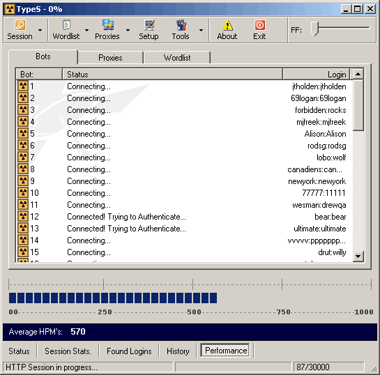



## TypeS \- Security analyzer

### Description

Test the strength of your website's authentication by using brute force dictionary method's! Not 100% complete but fully functional. FEATURES: Full proxy support - Load and validate proxy lists - Word manipulation - Use up to 99 socket's or 'Bots' at a time - and more...

Must rename TrayIcon.oc_ to TrayIcon.ocx.

All original code except for the BASE64 Encode and the TrayIcon.

Excellent examples of how to use Listview's, Toolbar's, Coolbar's, Winsock, and more
 
### More Info
 

             |
---                |---
**Submitted On**   |2002-07-18 10:36:00
**By**             |[Tom Bishop](https://github.com/Planet-Source-Code/PSCIndex/blob/master/ByAuthor/tom-bishop.md)
**Level**          |Advanced
**User Rating**    |4.6 (23 globes from 5 users)
**Compatibility**  |VB 4\.0 \(16\-bit\), VB 4\.0 \(32\-bit\), VB 5\.0, VB 6\.0, ASP \(Active Server Pages\) 
**Category**       |[Internet/ HTML](https://github.com/Planet-Source-Code/PSCIndex/blob/master/ByCategory/internet-html__1-34.md)
**World**          |[Visual Basic](https://github.com/Planet-Source-Code/PSCIndex/blob/master/ByWorld/visual-basic.md)
**Archive File**   |[TypeS\_\-\_Se1077747182002\.zip](https://github.com/Planet-Source-Code/tom-bishop-types-security-analyzer__1-37041/archive/master.zip)

